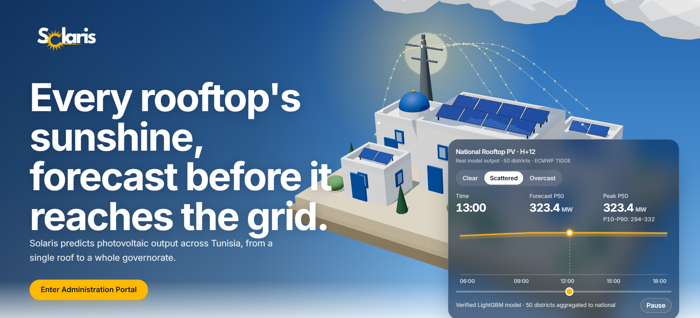
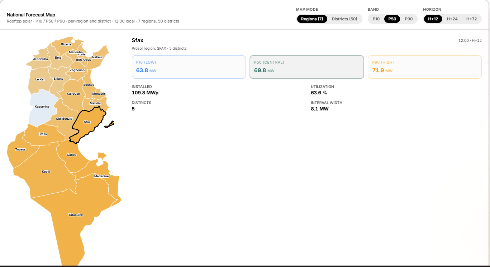

<div align="center">

#  Solaris

**A National Intelligent Platform for Forecasting Rooftop Solar Production in Tunisia**


[Overview](#overview) ·
[Results](#key-results) ·
[Quick Start](#quick-start) ·
[Architecture](#architecture) ·
[Evaluation Guide](#how-to-evaluate-this-project-in-3-minutes)

</div>

---

## Overview

**Prosol Forecast / Solaris** is a full-stack AI platform that forecasts rooftop photovoltaic (PV) production across Tunisia's 50 Prosol districts, quantifies uncertainty through P10 / P50 / P90 prediction intervals, and translates those forecasts into grid-impact indicators and battery decision-support simulations.

The project combines:

- **Official Prosol capacity data** — 50 districts, 7 regions, 514.8 MW installed
- **PVGIS historical PV reconstruction** — 2005 to 2023, 8.33M hourly records
- **Genuine ECMWF TIGGE numerical weather prediction (NWP)** forecasts
- **Leakage-safe machine learning** — LightGBM, quantile regression
- **A three-tier, production-ready software platform**

> **Scientific principle.** Forecast only from information that was available when the forecast was issued. This is enforced at every stage of the pipeline.

---

## Key Results

| Metric | Value | Verified On |
|---|---:|---|
| Deterministic LightGBM R² (2020 test) | **0.9662** | 2026-09-20 |
| Probabilistic interval coverage (calibrated) | **80.43%** | 2026-09-21 |
| NWP RMSE improvement (H+12 / H+24 / H+72) | **−7.26% / −6.19% / −5.58%** | 2026-09-22 |
| Districts improved by NWP | **50 / 50** at every horizon | 2026-09-22 |
| Independent verification | **18 / 18** checks passed | 2026-09-22 |
| Total training records | 8,326,800 | — |

Reproduce any of these with:

```bash
python verified/nwp/diagnostic.py
```

---

## Screenshots

| Home | Forecast Map |
|:---:|:---:|
|  |  |


> Screenshots are captured from the verified 2022 test-set window, not from a live API call. Every number is reproducible with the pipeline scripts.

---

## Quick Start

Three services. Three terminals. One command each.

### Prerequisites

| Requirement | Version |
|---|---|
| Python | 3.12+ |
| Node.js | 20+ |
| PHP | 8.2+ |
| Composer | latest |
| MySQL  | recent |

### Terminal 1 — Laravel Auth Backend (port 8000)

```bash
cd laravel-auth
composer install
cp .env.example .env
php artisan key:generate
php artisan jwt:secret
php artisan migrate
php artisan serve --host=0.0.0.0 --port=8000
```

### Terminal 2 — FastAPI ML Backend (port 5000)

```bash
pip install -r requirements.txt
uvicorn api.main:app --reload --host 0.0.0.0 --port 5000
```

### Terminal 3 — React Frontend (port 5173)

```bash
cd web
npm install
npm run dev
```

Create `web/.env.local`:

```env
VITE_API_URL=http://localhost:5000
VITE_AUTH_URL=http://localhost:8000
```

Open **http://localhost:5173/dashboard**.

> **Expected startup time.** Under 3 minutes on a clean machine, assuming Python, Node, PHP, and a database are already installed.

---

## Scientific Method

> **Forecast only from information that was available when the forecast was issued.**

Enforced at every stage:

- All rolling features use `shift(1).rolling(...)` — previous observations only.
- NWP inputs are archived forecasts with an explicit **issue time** and **valid time**.
- Actual weather at the forecast-valid time is never used as an input.
- PVGIS reconstruction is never described as measured STEG production.
- Grid-impact and battery outputs are explicitly labeled as decision-support simulations, not operational measurements.

---

## Architecture

```text
                    PROSOL INSTALLATIONS
                            |
                            v
                District installed capacity
                            |
                            v
                         PVGIS
                            |
                            v
               Historical PV reconstruction
                            |
                            v
              Leakage-safe feature engineering
                            |
        +-------------------+-------------------+
        |                                       |
        v                                       v
Historical PV behavior                  ECMWF TIGGE NWP
        |                                       |
        +-------------------+-------------------+
                            |
                            v
                       LightGBM
                            |
                            v
              Multi-horizon forecasting
                            |
             +--------------+--------------+
             |              |              |
             v              v              v
            P10            P50            P90
             |              |              |
             +--------------+--------------+
                            |
                            v
                     District MW
                            |
                            v
                       50 districts
                            |
                            v
                        7 regions
                            |
                            v
                     National Tunisia
                            |
                            v
                  Grid impact indicators
                            |
                            v
                Battery decision support
                            |
                            v
                 Full-stack dashboard
```

---

## Completed Phases

| Phase | Deliverable | Status |
|---|---|:---:|
| 1 | Data foundation — 50 districts, 7 regions, Prosol capacity | Passed |
| 2 | PVGIS historical reconstruction — 8.33M rows | Passed |
| 3 | Leakage-safe feature engineering — 52 features | Passed |
| 4.1 | Deterministic LightGBM — R² = 0.9662 | Passed |
| 4.2 | Probabilistic P10 / P50 / P90 — 80.43% coverage | Passed |
| 5.1 | Multi-horizon forecasting, H+1 to H+72 | Passed |
| 5.2 | Genuine ECMWF TIGGE NWP integration | Passed |
| 5.3 | District to region to national aggregation | Passed |
| 6.1 | Grid-impact indicators | Passed |
| 6.2 | Battery decision support | Passed |
| 7 | Full-stack platform (FastAPI + Laravel + React) | Passed |

---

## Technology Stack

<details>
<summary><strong>Machine Learning and Data</strong></summary>

| Component | Technology | Purpose |
|---|---|---|
| Language | Python 3.12 | Data processing and ML |
| Data processing | pandas, numpy | Feature engineering |
| ML models | LightGBM | Deterministic and quantile regression |
| Quantile forecasting | LightGBM quantile objective | P10 / P50 / P90 |
| GRIB parsing | cfgrib, xarray, eccodes | NWP archive handling |
| API backend | FastAPI + uvicorn | ML inference |
| Data storage | Parquet, CSV | Tabular artifacts |

</details>

<details>
<summary><strong>Authentication Backend</strong></summary>

| Component | Technology | Purpose |
|---|---|---|
| Framework | Laravel 11 | Auth service |
| JWT | tymon/jwt-auth | Token issuance |
| Storage | httpOnly cookies | XSS-safe token storage |
| Refresh | DB-backed, with rotation | Session continuity |
| Security | Rate limiting, request validation | Brute-force protection |
| Middleware | `InjectJwtFromCookie` | `auth:api` guard integration |

</details>

<details>
<summary><strong>Frontend</strong></summary>

| Component | Technology | Purpose |
|---|---|---|
| Build tool | Vite | Fast dev server and bundling |
| Framework | React 18 | UI |
| Language | TypeScript | Type-safe code |
| Styling | Tailwind CSS | Utility-first CSS |
| Components | shadcn/ui | Accessible UI primitives |
| State | Redux Toolkit | Auth and forecast state |
| Routing | React Router | SPA navigation |
| i18n | react-i18next | EN / FR / AR, RTL-aware |
| 3D | Three.js + @react-three/fiber | Solar visualizer |
| HTTP | Axios, with interceptors | Automatic token refresh |
| Charts | Recharts | Forecast and KPI charts |

</details>

---

## Repository Structure

<details>
<summary><strong>Show full directory tree</strong></summary>

```text
prosol-forecast/
|-- README.md
|-- requirements.txt
|-- package.json
|-- .gitignore
|-- .gitattributes
|
|-- api/                          # FastAPI ML backend
|   |-- main.py
|   |-- config.py
|   |-- routers/
|   |   |-- forecast.py
|   |   |-- districts.py
|   |   |-- regions.py
|   |   |-- grid.py
|   |   |-- battery.py
|   |   `-- methodology.py
|   `-- services/
|       `-- data_loader.py
|
|-- laravel-auth/                 # Laravel auth backend
|   |-- app/
|   |   |-- Http/
|   |   |   |-- Controllers/AuthController.php
|   |   |   |-- Middleware/InjectJwtFromCookie.php
|   |   |   `-- Requests/StoreUserRequest.php
|   |   `-- Models/
|   |       |-- User.php
|   |       `-- RefreshToken.php
|   |-- routes/api.php
|   |-- config/
|   |   |-- jwt.php
|   |   `-- cors.php
|   `-- database/migrations/
|       |-- create_users_table.php
|       `-- create_refresh_tokens_table.php
|
|-- data/
|   |-- reference/
|   |   |-- district_coordinates.csv
|   |   |-- district_region_mapping.csv
|   |   `-- regions.csv
|   |-- pv_registry/
|   |   `-- pv_registry.csv
|   `-- processed/
|       |-- prosol_district_capacity.csv
|       `-- (generated artifacts, not committed)
|
|-- scripts/nwp/                  # ML pipeline scripts
|   |-- 11_download_tigge_full.py
|   |-- 11b_download_tigge_12z.py
|   |-- 12_validate_tigge_grib.py
|   |-- 13_parse_tigge_all.py
|   |-- 14_build_phase52_dataset.py
|   |-- 15_phase51r_baseline.py
|   |-- 16_phase52_nwp.py
|   |-- 17_compare.py
|   |-- 18_feature_importance.py
|   |-- 19_district_analysis.py
|   |-- 20_phase53_aggregate.py
|   |-- 21_phase61_grid_impact.py
|   |-- 22_phase62_battery.py
|   |-- 24_phase52_quantile.py
|   |-- 24b_calibrate_quantiles.py
|   `-- 25_phase53_quantile_aggregate.py
|
|-- verified/
|   `-- nwp/
|       `-- diagnostic.py         # 18-check verification suite
|
|-- web/                          # React frontend
|   |-- src/
|   |   |-- app/
|   |   |-- components/dashboard/
|   |   |   |-- ForecastChart.tsx
|   |   |   |-- ForecastMap.tsx
|   |   |   |-- ForecastBentoGrid.tsx
|   |   |   |-- GridKPICards.tsx
|   |   |   |-- WeatherModelStrip.tsx
|   |   |   |-- AlertFeed.tsx
|   |   |   |-- ZoneStatusTable.tsx
|   |   |   |-- LoadSolarBalanceChart.tsx
|   |   |   |-- RampRateChart.tsx
|   |   |   |-- InstallationKPICards.tsx
|   |   |   `-- InstallationTable.tsx
|   |   |-- hooks/
|   |   |   |-- useDashboardData.ts
|   |   |   `-- useWeatherModelStrip.ts
|   |   |-- lib/axios.ts
|   |   |-- services/auth/
|   |   |   |-- auth_service.ts
|   |   |   `-- auth_types.ts
|   |   |-- store/
|   |   |   |-- authSlice.ts
|   |   |   |-- hooks.ts
|   |   |   `-- index.ts
|   |   |-- i18n/
|   |   |   |-- index.ts
|   |   |   `-- locales/{en,fr,ar}.json
|   |   `-- types/
|   |       |-- grid.ts
|   |       |-- Tunisiageo.ts
|   |       `-- useDark.ts
|   |-- public/
|   |-- package.json
|   `-- vite.config.ts
|
`-- docs/
    |-- methodology.md
    |-- results.md
    `-- limitations.md
```

</details>

---

## Reproducing the ML Pipeline

<details>
<summary><strong>Show the 9-step pipeline</strong></summary>

```bash
# Step 1 - Download the TIGGE archive
python scripts/nwp/11_download_tigge_full.py
python scripts/nwp/11b_download_tigge_12z.py

# Step 2 - Validate all 59 GRIB files
python scripts/nwp/12_validate_tigge_grib.py

# Step 3 - Parse GRIBs into district-level forecasts
python scripts/nwp/13_parse_tigge_all.py

# Step 4 - Build the Phase 5.2 training dataset
python scripts/nwp/14_build_phase52_dataset.py

# Step 5 - Train the baseline and NWP models
python scripts/nwp/15_phase51r_baseline.py
python scripts/nwp/16_phase52_nwp.py

# Step 6 - Compare and verify
python scripts/nwp/17_compare.py
python verified/nwp/diagnostic.py

# Step 7 - Quantile training and calibration
python scripts/nwp/24_phase52_quantile.py
python scripts/nwp/24b_calibrate_quantiles.py

# Step 8 - Aggregation
python scripts/nwp/20_phase53_aggregate.py
python scripts/nwp/25_phase53_quantile_aggregate.py

# Step 9 - Grid impact and battery simulation
python scripts/nwp/21_phase61_grid_impact.py
python scripts/nwp/22_phase62_battery.py
```

</details>

---

## API Reference

### FastAPI ML Backend — port 5000

| Endpoint | Method | Purpose |
|---|:---:|---|
| `/api/health` | GET | Health check |
| `/api/forecast/national/quantile` | GET | National P10 / P50 / P90 forecast |
| `/api/districts` | GET | District-level point forecast |
| `/api/districts/quantile` | GET | District-level P10 / P50 / P90 |
| `/api/regions` | GET | Regional point forecast |
| `/api/regions/quantile` | GET | Regional P10 / P50 / P90 |
| `/api/grid/impact` | GET | Grid-impact indicators |
| `/api/battery/simulation` | GET | Battery decision support |
| `/api/methodology/phase52` | GET | Phase 5.2 verified results |

### Laravel Auth Backend — port 8000

| Endpoint | Method | Purpose |
|---|:---:|---|
| `/api/auth/register` | POST | Register a new user |
| `/api/auth/login` | POST | Log in (sets httpOnly cookies) |
| `/api/auth/refresh` | POST | Rotate tokens |
| `/api/me` | GET | Current user (protected) |
| `/api/auth/logout` | POST | Invalidate session |

---

## Verification

Every result in this repository is independently verified. The diagnostic suite runs 18 checks against the pipeline outputs:

```bash
python verified/nwp/diagnostic.py
```

Expected output:

```text
Passed: 18/18
PHASE 5.2 - VERIFIED
```

The checks include:

- No duplicate rows
- No `NaN` in predictions
- No negative predictions
- `valid_time = issue_time + lead_time`
- RMSE reproduces from raw predictions
- No target leakage
- 50 districts represented per horizon
- Chronological train / validation / test split preserved
- Positive skill vs. persistence baseline

---

## Limitations (Documented Honestly)

> **We do not hide gaps.** Every limitation below is deliberately documented so that no result can be misinterpreted.

1. **The target is PVGIS-reconstructed**, not measured STEG rooftop production.
2. **H+1 is unavailable** in the current NWP configuration — TIGGE is 6-hourly.
3. **February 2019 is missing** due to an ECMWF tape hardware failure (tape `J0018900`). The month is excluded, not fabricated.
4. **Grid-impact indicators are proxies**, not actual STEG reserve requirements.
5. **Battery results are decision-support simulations**, not actual STEG battery fleet operations.
6. **Empirical interval coverage exceeds the 80% nominal target** on the held-out 2022 test set, due to distribution shift between the calibration and validation windows. Over-coverage is the safe failure direction.
7. **Regional capacity sums to 515.1 MW** while the headline Prosol snapshot is 514.8 MW. The discrepancy is retained for traceability.

---

## Data Sources

| Source | Purpose | Coverage | Link |
|---|---|---|---|
| Prosol / STEG / ANME | Official capacity data | 2025-2026 | [prosol.tn](https://www.prosol.tn/) |
| PVGIS 5.3 | Historical PV reconstruction | 2005-2023 | [re.jrc.ec.europa.eu](https://re.jrc.ec.europa.eu/pvg_tools/) |
| ECMWF TIGGE | Genuine NWP forecasts | 2006-present | [ecmwf.int](https://www.ecmwf.int/en/forecasts/datasets/tigge) |

---

## Research Integrity

This project follows strict scientific discipline:

- No fabricated data.
- No hidden missing data.
- No future observations used as forecast inputs.
- No confusion between reconstruction, reanalysis, forecast, and measurement.
- No overclaiming of prediction-interval accuracy.
- No comparison of models on different test populations.
- No invented Prosol district capacities.
- No claim that simulations represent actual STEG operations.

Every quantity in this project is one of the following, and is labeled accordingly wherever it appears:

`observation` · `reconstruction` · `reanalysis` · `forecast` · `model prediction` · `proxy` · `simulation`

---

## Authors

**Solaris Team**
 IEEE ENICarthage PES SBC

## Acknowledgements

- **STEG / ANME** — official Prosol capacity data
- **European Commission Joint Research Centre** — PVGIS
- **ECMWF** — TIGGE archive access
- The open-source communities behind LightGBM, FastAPI, Laravel, React, Redux, Three.js, and Recharts
